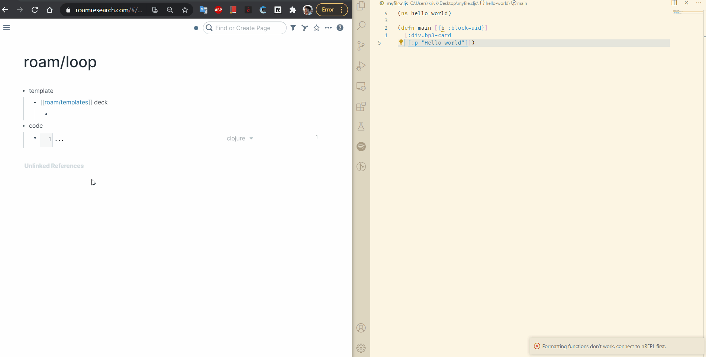

# RoamFS

Allows you to write your code in your favorite code editor and get it synced to a Roam code block. Ideal for learning [[roam/render]]!

## How to install

Right now, this is not hosted anywhere, so you'll have to clone this repository, run `yarn install` and then `parcel src/index.ts`.

After that, it's the usual... make a block containing `{{[[roam/js]]}}`, create a Javascript code block below, paste

```
var s = document.createElement("script");
s.src = "http://localhost:1234/index.js";
s.id = "roamfs";
s.type = "text/javascript";
document.getElementsByTagName("head")[0].appendChild(s);
```

...and allow the script.

Right click 
